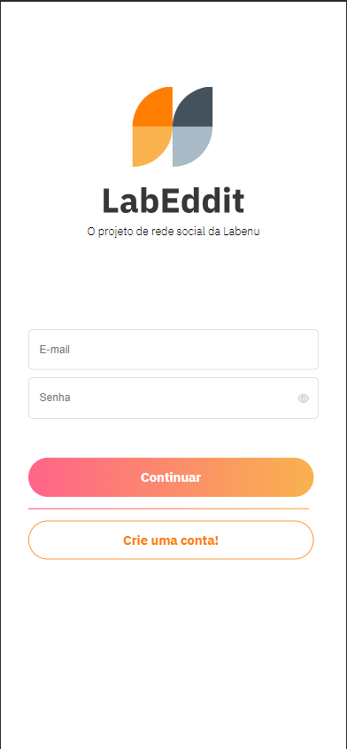
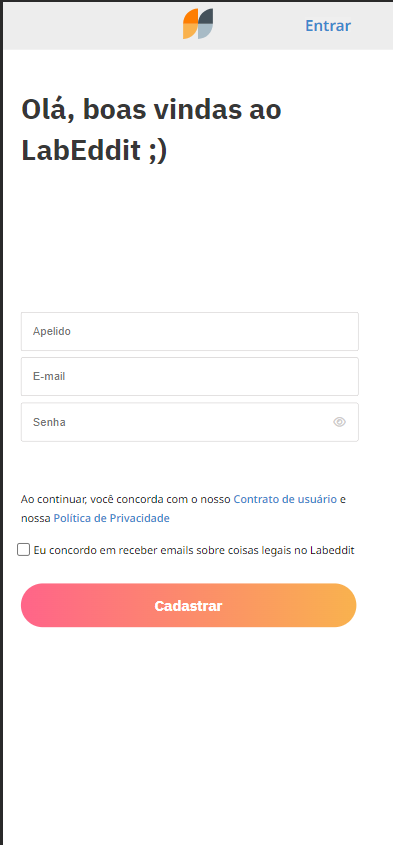
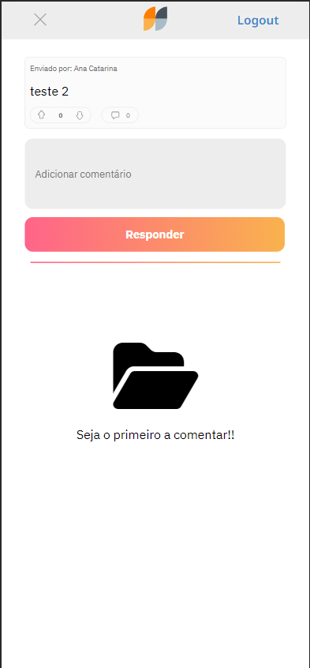
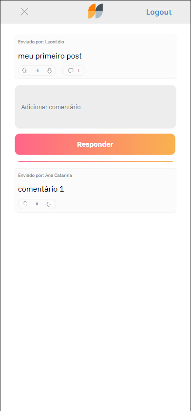

# Labeddit - social network


This application is a the mobile frontend part of a social network called Labeddit. It allows the user to login, signup, create a post, like or dislike any post in the site, comment on a post and like or dislike any comment. 

The app is already integrated with the backend API (documentation: https://documenter.getpostman.com/view/26594436/2s9YCBvVjy).

## Index
- <a href="#functionalities">Application functionalities</a>
- <a href="#layout">Layout</a>
- <a href="#demonstration">Demonstration</a>
- <a href="#run">How to run the application</a>
- <a href="#tecnologies-used">Tecnologies used</a>
- <a href="#developer">Developer</a>
- <a href="#next-steps">Next steps</a>

## Application functionalities
 - [x]  Login with an existing account
 - [x]  Signup with a new account
 - [x]  Create a new post
 - [x]  View other posts
 - [x]  Like/dislike a post
 - [x]  Comment on a post
 - [x]  View other comments
 - [x]  Like/dilsike a comment


## Layout
1. Login screen



2. Signup screen



3. Feed sreen



3. Comment sreen




## Demonstration

[Link (deploy)](https://labeddit-julsbg.surge.sh/)


https://github.com/Julia-slvbrg/labeddit-frontend/assets/114543081/ad49947f-5687-42c9-b309-d9cbab960902


https://github.com/Julia-slvbrg/labeddit-frontend/assets/114543081/7ad5f65f-c1f1-437d-8988-833c6cee7cc5


## How to run the application
```bash
# Clone this repository
$ git clone repolink

# Acess the app folder on your terminal
$ cd labeddit-frontend

# Install the dependencies
$ npm install

# Run the app 
$ npm run dev

# Acesse a apicação pelo navegador:
http://127.0.0.1:5173/
```

## Tecnologies used
1. [React JS](https://react.dev/)
2. [Vite](https://vitejs.dev/)
3. Styled-components
4. React Router
5. React Context
6. React Hooks
7. [Labeddit-backend API](https://documenter.getpostman.com/view/26594436/2s9YCBvVjy)
8. Material UI

## Developer
[LinkedIn](https://www.linkedin.com/in/julia-silva-borges/)

## Next steps
 - [ ] Add functions to edit posts and comments
 - [ ] Add functions to delete posts and comments
